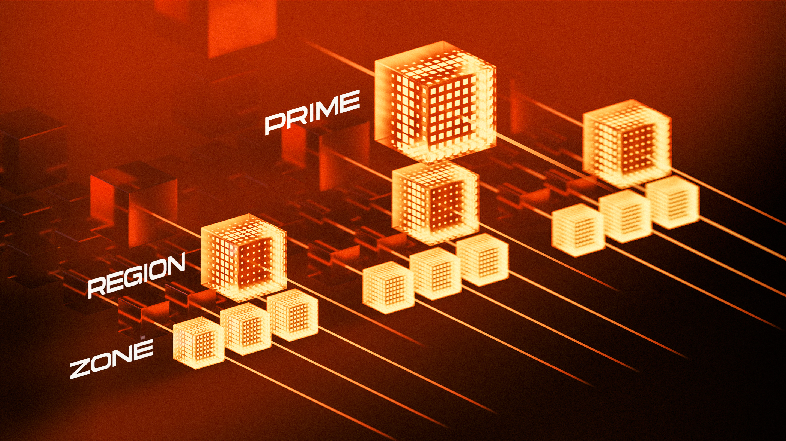

# Quai Network

Quai Network is the only decentralized cryptocurrency with the capacity to scale to **all global commerce**.

Quai is a [merge-mined](../learn/advanced-introduction/merged-mining/merged-mining.md) network of blockchains. This network is able to [coordinate an infinite number of blockchains (execution shards)](../learn/advanced-introduction/poem/infinite-execution-shards/infinite-execution-shards.md) by using the [Proof-of-Entropy-Minima (PoEM) consensus mechanism](../learn/advanced-introduction/poem/poem.md), which eliminates all consensus-based contention. The ability for PoEM to coordinate a perpetually growing set of blockchains allows the network to process **more than 50,000 transactions per second**. The architecture is a composable [multithreaded execution](../learn/advanced-introduction/multithreaded-execution.md) environment with blocks being produced approximately every 1.1 seconds in a [9-shard construction](../learn/advanced-introduction/poem/infinite-execution-shards/dynamic-sharding.mdx).

All blockchains in the network can transfer and receive state through the process of [merged mining](../learn/advanced-introduction/merged-mining/merged-mining.md), which asynchronously produces [hash linked references between chains](../learn/advanced-introduction/merged-mining/coincident-blocks.mdx). Quai extends traditional work-based block production to enable transfers between blockchains without introducing new trusted validation mechanisms.

Quai provides truly infinite scalability by [dynamically sharding](../learn/advanced-introduction/poem/infinite-execution-shards/dynamic-sharding.mdx) to add more execution shards to the network as demand for block space increases. This enables Quai to support low-cost day-to-day transactions as the user-base grows in perpetuity.

While blockchain technology has shown its potential to enable a widely-used digital currency, existing solutions reintroduce subjectivity while only achieving limited scale. Quai is unlike other multi-chain solutions which require a trusted set of validators that create weak security guarantees when moving between chains.

Quai addresses issues with scalability while maintaining decentralization to create an un-censorable network which can be ubiquitously used as money.

## What does "Quai" mean?

The word Quai derives its origin from the word kuai (块 – kuài). "Kuai" is a colloquial measure word for money, like "quid" in the UK and "buck" in the US, but it is the word used in everyday Mandarin. The use of the word "kuai", literally means "piece", and is the word used historically for coins made of silver or copper.

## Key Features

### Merged-Mined Hierarchy

All of Quai blockchains are organized into a three-tiered network hierarchy. Each miner must mine three blockchains within the network simultaneously. Merged mining allows miners to increase throughput while also reusing hash to secure multiple blockchains, making mining up to [10,000 times more energy efficient](../learn/advanced-introduction/merged-mining/energy-efficiency.mdx)*.

### Multithreaded

Current blockchains are unable to provide enough block space to find reasonable market equivalence with demand, leading to high gas fees during periods of sustained usage. Quai Network introduces [multithreaded blockchain execution](../learn/advanced-introduction/multithreaded-execution.md), which drastically increases the available supply of block space across many interconnected blockchains.

Through the use of multithreaded execution, Quai Network is able to process upwards of 50,000 transactions per second.

### Infinitely Scalable

Through the use of the [Proof-of-Entropy-Minima consensus mechanism](../learn/advanced-introduction/poem/poem.md), which eliminates all contention from consensus, Quai Network is able to remain in consensus while [coordinating an infinitely growing number of execution shards](../learn/advanced-introduction/poem/infinite-execution-shards/infinite-execution-shards.md). This property allows Quai Network to algorithmically add execution shards to the network in order to meet perpetually growing demand. The only tradeoff to adding execution shards to Quai (and thus increasing throughput) is an [increased time to global settlement](../learn/advanced-introduction/poem/infinite-execution-shards/dynamic-sharding.mdx).

**Per transaction, assuming full transactional load and the same number of miners on both Quai Network and the Bitcoin Network*.